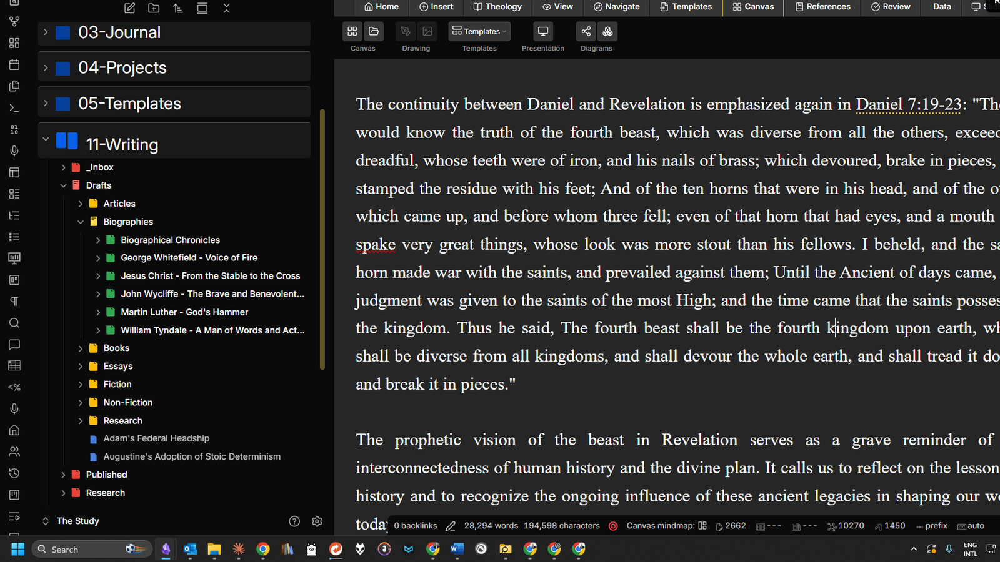

# Arcadia Toolbar

Arcadia Toolbar brings a Word-processor-style ribbon to Obsidian: eleven tabs of one-click tools for formatting, tables, citations, slides, navigation, and study work, all sitting above the editor where you expect them. If you came to Obsidian from Word, OneNote, or Google Docs and miss having your tools visible, this plugin closes that gap without changing how your Markdown files are stored.

> Desktop only.

## Features

| Feature | Free | Premium |
| ------- | :--: | :-----: |
| Home tab: bold, italic, underline, highlight, font and background colors, headings, lists, alignment, indent | Yes | Yes |
| Insert tab: links, images, embeds, tables, code blocks, callouts, footnotes, symbols, math | Yes | Yes |
| Data tab: table size picker, templates, add/delete rows, sort, filter, transpose, CSV import and export | Yes | Yes |
| References tab: Turabian, Chicago, APA, and MLA citations plus bibliography generation | Yes | Yes |
| Slides tab: slide breaks, layouts, themes, speaker notes (Advanced Slides) | Yes | Yes |
| View, Navigate, Templates, Canvas, and Review tabs | Yes | Yes |
| Table of contents sidebar (pinnable, follows the active note) | Yes | Yes |
| Per-tab visibility toggles in settings | Yes | Yes |
| Theology tab: scripture blocks, cross-references, commentary and language notes | No | Yes |
| Scripture hover lookup: Bible text, commentary, or dictionary popups on any reference | No | Yes |
| AI tools row: generate and fill tables, calculated columns, citation conversion, notes to slides (bring your own API key) | No | Yes |

## Installation

The Community Plugins listing is pending review. Until it is approved, install with one of these methods:

### Manual install (GitHub releases)

1. Download `main.js`, `manifest.json`, and `styles.css` from the latest [GitHub release](https://github.com/Arcadia-Studio/obsidian-arcadia-toolbar/releases)
2. Create the folder `.obsidian/plugins/arcadia-toolbar/` inside your vault and copy the three files into it
3. Reload Obsidian, then enable Arcadia Toolbar under Settings > Community plugins

### BRAT

1. Install the [BRAT](https://obsidian.md/plugins?id=obsidian42-brat) plugin
2. In BRAT, choose "Add beta plugin" and enter `Arcadia-Studio/obsidian-arcadia-toolbar`
3. Enable Arcadia Toolbar under Settings > Community plugins

## Quick start

1. Open any Markdown note in editing view. The ribbon appears at the top of the editor pane.
2. Click a tab (Home, Insert, Data, and so on) to switch tool groups. The active tab is remembered.
3. Select text and click a formatting button, or place the cursor and click an insert button.
4. For table tools, place the cursor inside any Markdown table, then use the Data tab.
5. Toggle the table of contents sidebar with the list icon in Obsidian's left ribbon or the "Toggle table of contents" command.

The ribbon hides its editing tabs in reading view and shows a short notice instead. Tabs you never use can be hidden in settings.

## Settings reference

| Setting | What it does |
| ------- | ------------ |
| Ribbon tabs | One toggle per tab (Home, Insert, Theology, View, Navigate, Templates, Canvas, References, Review, Data, Slides) |
| Pin table of contents on startup | Opens the TOC panel automatically when Obsidian starts |
| Default translation | Translation label used by scripture blocks (ESV, NIV, KJV, NASB, NLT, CSB, NKJV, RSV) |
| Hover bible translation | Translation used for Bible text popups (KJV, ASV, BBE, DARBY, WEB, YLT) |
| Default commentary | Public domain commentary source for hover popups (Barnes, Matthew Henry, Gill, Clarke, JFB, Cambridge) |
| Default dictionary | Bible dictionary source for hover popups |
| AI provider | OpenAI, Anthropic, Google, xAI, or Microsoft Copilot |
| API key | Your own AI API key, stored locally in this vault's plugin data |
| Model | Model selection for the chosen provider |
| License key | Premium license entry and validation |

## Pricing

Core features are free. The Theology tab, scripture hover lookup, and the AI tools row require a premium license from [arcadia-studio.lemonsqueezy.com](https://arcadia-studio.lemonsqueezy.com).

To activate: Settings > Arcadia Toolbar > License key, then click Validate. Validation is cached, and a grace period keeps premium features working when you are offline.

## Support

Questions, bug reports, and feature requests: [arcadiastudio77@gmail.com](mailto:arcadiastudio77@gmail.com), or open an issue on the [GitHub repository](https://github.com/Arcadia-Studio/obsidian-arcadia-toolbar).

## License

The source code is licensed under the [MIT license](LICENSE). A premium license unlocks the premium feature set; it does not change the code license.
